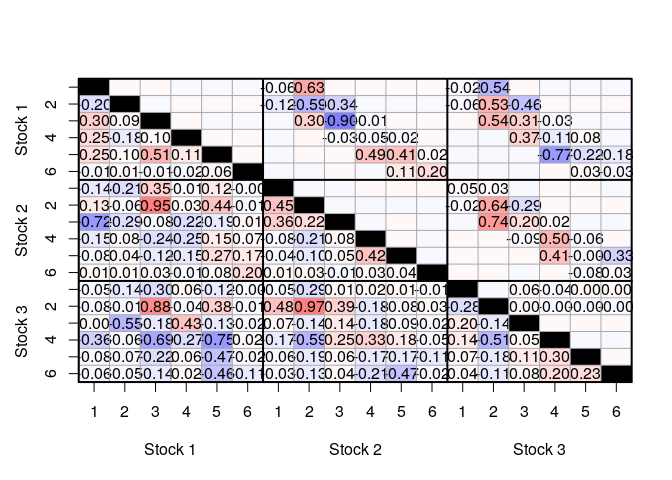
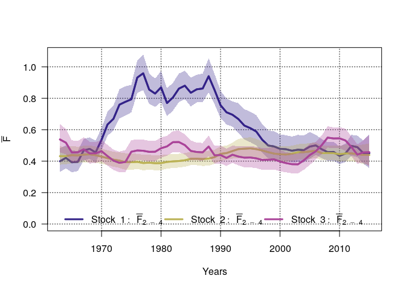
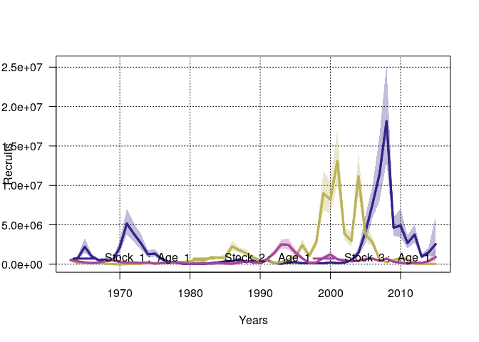

# multiStockassessment

The `multiStockassessment` package extends the
[`stockassessment`](https://github.com/fishfollower/SAM) to allow linked
stocks (See e.g. Albertsen, C. M., Nielsen, A., and Thygesen, U. H.
(2018) Connecting single-stock assessment models through correlated
survival. *ICES Journal of Marine Science*, 75(1), 235-244. doi:
[10.1093/icesjms/fsx114](https://dx.doi.org/10.1093/icesjms/fsx114)).
The package can be installed with
`devtools`:

``` r
devtools::install_github("calbertsen/multi_SAM", subdir = "multiStockassessment")
```

## Short example

To use the `multiStockassessment` package, the individual stocks must
first be fitted with the `stockassessment` package and combined to a
`samset` using the `c(...)` function.

### Preparing data using stockassessment

The code below loads the North Sea cod data from the stockassessment
package, fits it, simulates two new data sets and fit those
individually.

``` r
library(stockassessment)

data(nscodData)
data(nscodConf)
data(nscodParameters)

set.seed(9876)
fit <- sam.fit(nscodData, nscodConf, nscodParameters,sim.condRE = FALSE)

datSim <- simulate(fit,nsim=3)
fitSim <- do.call("c",lapply(datSim,function(x)sam.fit(x,nscodConf, nscodParameters)))
```

### Creating correlation structure

``` r
library(multiStockassessment)
```

After the simulated data have been fitted and combined by the `c`
function, the `multiStockassessment` package can be used to fit a model
with correlated survival.

The `suggestCorStructure` function can be used to set up the correlation
matrix. The `nAgeClose` argument can be used to construct the banded
structures used in the paper. The result is a logical symmetric matrix
indicating whether a correlation should be fixed at zero. The dimension
of the matrix is the number of stocks times the number of ages in the
data.

For instance, `suggestCorStructure(fitSim,nAgeClose=1)` creates a matrix
where ages less than 1 appart are correlated between the stocks:

``` r
cs <- suggestCorStructure(fitSim,nAgeClose=2)
cs
```

    ##        [,1]  [,2]  [,3]  [,4]  [,5]  [,6]  [,7]  [,8]  [,9] [,10] [,11]
    ##  [1,]  TRUE  TRUE  TRUE  TRUE  TRUE  TRUE FALSE FALSE  TRUE  TRUE  TRUE
    ##  [2,]  TRUE  TRUE  TRUE  TRUE  TRUE  TRUE FALSE FALSE FALSE  TRUE  TRUE
    ##  [3,]  TRUE  TRUE  TRUE  TRUE  TRUE  TRUE  TRUE FALSE FALSE FALSE  TRUE
    ##  [4,]  TRUE  TRUE  TRUE  TRUE  TRUE  TRUE  TRUE  TRUE FALSE FALSE FALSE
    ##  [5,]  TRUE  TRUE  TRUE  TRUE  TRUE  TRUE  TRUE  TRUE  TRUE FALSE FALSE
    ##  [6,]  TRUE  TRUE  TRUE  TRUE  TRUE  TRUE  TRUE  TRUE  TRUE  TRUE FALSE
    ##  [7,] FALSE FALSE  TRUE  TRUE  TRUE  TRUE  TRUE  TRUE  TRUE  TRUE  TRUE
    ##  [8,] FALSE FALSE FALSE  TRUE  TRUE  TRUE  TRUE  TRUE  TRUE  TRUE  TRUE
    ##  [9,]  TRUE FALSE FALSE FALSE  TRUE  TRUE  TRUE  TRUE  TRUE  TRUE  TRUE
    ## [10,]  TRUE  TRUE FALSE FALSE FALSE  TRUE  TRUE  TRUE  TRUE  TRUE  TRUE
    ## [11,]  TRUE  TRUE  TRUE FALSE FALSE FALSE  TRUE  TRUE  TRUE  TRUE  TRUE
    ## [12,]  TRUE  TRUE  TRUE  TRUE FALSE FALSE  TRUE  TRUE  TRUE  TRUE  TRUE
    ## [13,] FALSE FALSE  TRUE  TRUE  TRUE  TRUE FALSE FALSE  TRUE  TRUE  TRUE
    ## [14,] FALSE FALSE FALSE  TRUE  TRUE  TRUE FALSE FALSE FALSE  TRUE  TRUE
    ## [15,]  TRUE FALSE FALSE FALSE  TRUE  TRUE  TRUE FALSE FALSE FALSE  TRUE
    ## [16,]  TRUE  TRUE FALSE FALSE FALSE  TRUE  TRUE  TRUE FALSE FALSE FALSE
    ## [17,]  TRUE  TRUE  TRUE FALSE FALSE FALSE  TRUE  TRUE  TRUE FALSE FALSE
    ## [18,]  TRUE  TRUE  TRUE  TRUE FALSE FALSE  TRUE  TRUE  TRUE  TRUE FALSE
    ##       [,12] [,13] [,14] [,15] [,16] [,17] [,18]
    ##  [1,]  TRUE FALSE FALSE  TRUE  TRUE  TRUE  TRUE
    ##  [2,]  TRUE FALSE FALSE FALSE  TRUE  TRUE  TRUE
    ##  [3,]  TRUE  TRUE FALSE FALSE FALSE  TRUE  TRUE
    ##  [4,]  TRUE  TRUE  TRUE FALSE FALSE FALSE  TRUE
    ##  [5,] FALSE  TRUE  TRUE  TRUE FALSE FALSE FALSE
    ##  [6,] FALSE  TRUE  TRUE  TRUE  TRUE FALSE FALSE
    ##  [7,]  TRUE FALSE FALSE  TRUE  TRUE  TRUE  TRUE
    ##  [8,]  TRUE FALSE FALSE FALSE  TRUE  TRUE  TRUE
    ##  [9,]  TRUE  TRUE FALSE FALSE FALSE  TRUE  TRUE
    ## [10,]  TRUE  TRUE  TRUE FALSE FALSE FALSE  TRUE
    ## [11,]  TRUE  TRUE  TRUE  TRUE FALSE FALSE FALSE
    ## [12,]  TRUE  TRUE  TRUE  TRUE  TRUE FALSE FALSE
    ## [13,]  TRUE  TRUE  TRUE  TRUE  TRUE  TRUE  TRUE
    ## [14,]  TRUE  TRUE  TRUE  TRUE  TRUE  TRUE  TRUE
    ## [15,]  TRUE  TRUE  TRUE  TRUE  TRUE  TRUE  TRUE
    ## [16,]  TRUE  TRUE  TRUE  TRUE  TRUE  TRUE  TRUE
    ## [17,] FALSE  TRUE  TRUE  TRUE  TRUE  TRUE  TRUE
    ## [18,] FALSE  TRUE  TRUE  TRUE  TRUE  TRUE  TRUE

The `suggestCorStructure` function has several options to configure the
correlation structure, and the result can be modified by hand for
complete freedom.

### Fitting the model

The model is fitted by the `multisam.fit` function. The function
requires a `samset` and a correlaiton structure. By default, the
correlation structure given models the partial correlations between
cohorts. This can be changed to regular correlations by setting
`usePartialCors =
    FALSE`.

``` r
obj <- multisam.fit(fitSim,cs)
```

``` r
obj
```

    ## Multi-SAM model with 3 stocks: log likelihood is -346.6933. Convergence OK.

### Investigating the result

Most plotting and table functions from the `stockassessment` package
have a corresponding version in `multiStockassessment`.

The fitted correlation structure can be plotted by

``` r
corplot(obj)
```

<!-- -->

Other plotting functions implemented from the `stockassessment` package
are

``` r
fbarplot(obj)
```

<!-- -->

``` r
ssbplot(obj)
```

<!-- -->

``` r
ssbplot(obj)
```

<!-- -->

``` r
tsbplot(obj)
```

<!-- -->

``` r
recplot(obj)
```

<!-- -->

``` r
catchplot(obj)
```

<!-- -->

``` r
srplot(obj)
```

<!-- -->

``` r
fitplot(obj,1)
```

<!-- -->

Note that the `fitplot` function above requires the stock to be
specified.

``` r
fitplot(obj,2)
```

<!-- -->

### Comparing models

Models can be compared with the `modeltable` function. For instance, the
model above can be compared to individual assessments by

``` r
cs2 <- suggestCorStructure(fitSim,nAgeClose=0)
obj2 <- multisam.fit(fitSim,cs2)
```

``` r
modeltable(obj,obj2)
```

    ##       log(L) #par      AIC Pval( M1 -> M2 )
    ## M1 -346.6933  150 993.3867               NA
    ## M2 -376.2874  102 956.5747        0.1291461
